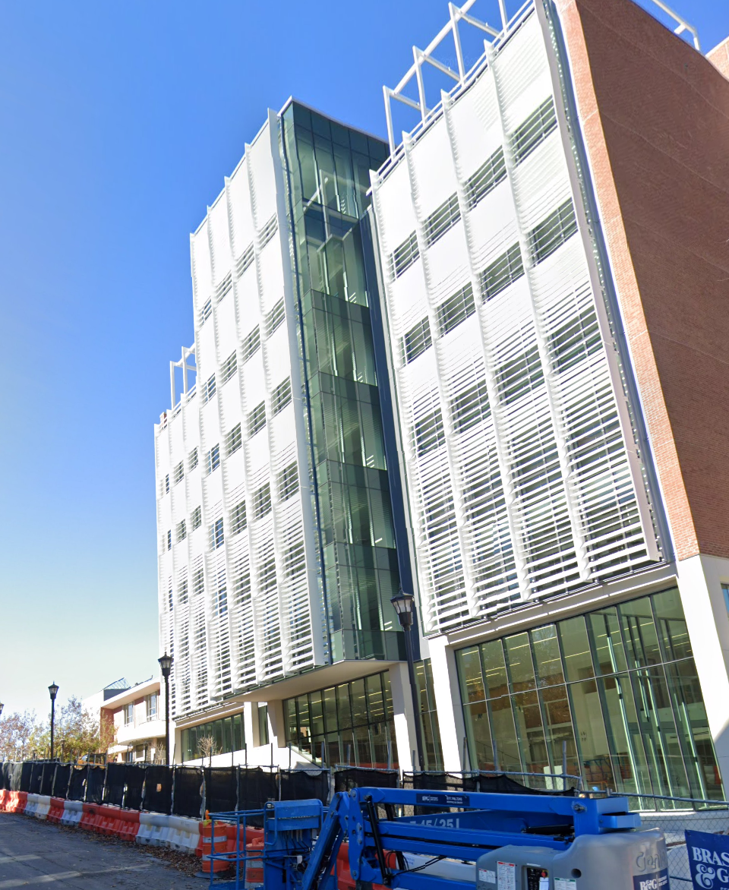

# OSINT Golf Challenge Report

## Challenge Details

- Name: chall1
- Category: OSINT
- Platform: https://osint.golf/

## Challenge Description

The challenge provides a 360 degree panoramic image and requires determining the geographic location within 200 meters.

## Solution Summary

The solution involved:

- Inspecting the image which showed a large building 

- Performing a reverse image search using Google which found a matching image on Georgia Tech's website
- Searching for Georgia Tech's campus map which showed the location of the building
- Pinpointing the location of the builing within 200 meters on the map

By reverse image searching to identify the building, we determined the geographic location of the panorama was on the Georgia Tech's campus . 
